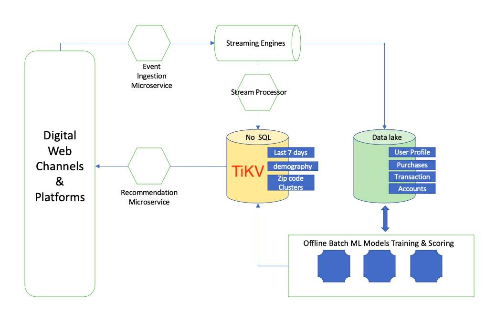

# RFC: Online Bulk Load for RawKV

- RFC PR: https://github.com/tikv/rfcs/pull/72
- Tracking Issue: https://github.com/tikv/tikv/issues/10563
- [Proposal: TiKV Online Bulk Load (Chinese)](https://docs.google.com/document/d/1JggGwmOIMqinz_Q7QkIDHzwS--K_BgJopaxrB8Pzpaw/edit#)

## Summary

Let RawKV support Online Bulk Load.

## Motivation

In the use use of `Feature Store`, everyday machine learning jobs will train a
large amount of data that needs to load to TiKV for online serving.



In order to satisfy this scenario, TiKV needs to provide `online bulk load`,
which should meet the following requirements:

1. the loading process should be as fast as possible,
2. the impact to the online serving (P99 latency) should be under control,
3. the loading speed can be improved in a linear way by adding more tikv instances,
4. the loading framework should be able to process Big Data (500GB ~ 5TB) in a short period (from minutes to several hours).

## Detailed design

The solution proposed in this RFC is as follows:

1. use distributed computing framework `Spark` to read the source files, convert
and encode the trained data into Key Value format,
2. sample the Key Value pairs, calculate the region split points, and call
`split region and scatter` API
3. repartition the Key Value pairs RDD according to the new Regions, sort inside each partition,
use the [Import SST API](https://github.com/pingcap/kvproto/blob/release-5.0/proto/import_sstpb.proto#L34)
to concurrently send the Key-Value pairs to the TiKV server and generate SST
files on the TiKV server,
4. use the [Ingest API](https://github.com/pingcap/kvproto/blob/release-5.0/proto/import_sstpb.proto#L53)
to ingest the generated SST files into TiKV.


### Proto

```
service ImportSST {
  rpc RawWrite(stream RawWriteRequest) returns (RawWriteResponse) {}
}

message RawWriteBatch {
    uint64 ttl = 1;
    repeated Pair pairs = 2;
}

message RawWriteRequest {
    oneof chunk {
        SSTMeta meta = 1;
        RawWriteBatch batch = 2;
    }
}

message RawWriteResponse {
    Error error = 1;
    repeated SSTMeta metas = 2;
}
```

### Rate Limit

We want to control the impact to the online serving (P99 latency) during the bulk load, so `Rate Limit` is an important component.

#### config import.num-threads

First of all, users can config the thread number of the import module, which is already implemented.

```
[import]
## Number of threads to handle RPC requests.
# num-threads = 8
```

#### config storage.io-rate-limit

[storage.io-rate-limit](https://docs.pingcap.com/tidb/stable/tikv-configuration-file#storageio-rate-limit) limits the maximum I/O bytes that a server can write to or read from the disk.

Users can use `io-rate-limit` to limit Disk Write of the `import` module:

- config storage.io-rate-limit.max-bytes-per-sec
- config storage.io-rate-limit.import-priority = "low"


If the total disk write < max-bytes-per-sec, the `import` module will not be limited.
If the total disk write >= max-bytes-per-sec, the `import` module will be limited.

### Why Spark

The loading framework should be able to process Big Data (500GB ~ 5TB), so we need to use a distributed calculation engine. Spark is chosen because:

1. Spark is widely used in major companies,
2. Spark is very good at doing this kind of job.

## Drawbacks

Learning spark has a certain cost.

## Others

A new repository (`tikv/migration`) is needed to store the spark-related codes.
