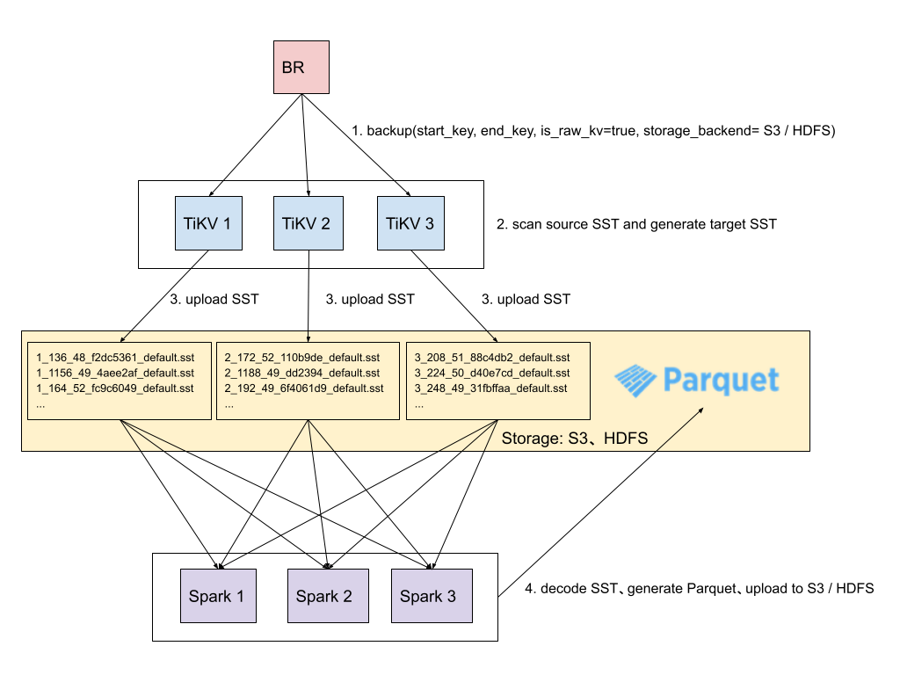

# RFC: RawKV Batch Export

- RFC PR: https://github.com/tikv/rfcs/pull/76
- Tracking Issue: https://github.com/tikv/tikv/issues/11007
- [Proposal: RawKV SST Export (Chinese)](https://docs.google.com/document/d/1IpraWthiFBWKHeDVX3x7aQ6X7pqzknHlfCQpyaMDBWQ/edit)

## Summary

Let RawKV support Batch Export.

## Motivation

More and more users want to use RawKV as online store in [the feature store](https://www.featurestore.org/).

But two important functions are missing:

- data import, which is done in [Online Bulk Load](https://github.com/tikv/tikv/issues/10563).
- data export, which we want to provide in this RFC.

`RawKV Batch Export` should meet the following requirements:

1. the export process should be as fast as possible,
2. the impact to the online serving (P99 latency) should be under control,
3. the export speed can be improved in a linear way by adding more tikv instances,
4. the export framework should be able to process Big Data (500GB ~ 5TB) in a short period (from minutes to several hours).

## Detailed design

The solution proposed in this RFC is as follows:

1. Using [RawKV backup](https://docs.pingcap.com/zh/tidb/stable/use-br-command-line-tool#raw-kv-%E5%A4%87%E4%BB%BD%E5%AE%9E%E9%AA%8C%E6%80%A7%E5%8A%9F%E8%83%BD) provide by BR, TiKV can backup SST files to S3. But HDFS is not supported yet, which is describe in [Support upload SST to HDFS](#support-upload-sst-to-hdfs).
2. After uploading SST files to S3 / HDFS, we will use Spark to decode the SST files to Key-Value pairs with the help of [the RocksDB SstFileReader API](https://github.com/facebook/rocksdb/blob/6.23.fb/java/src/main/java/org/rocksdb/SstFileReader.java). And then the Key-Value pairs will be convert to user firendly file formats like parquet, which can be controlled by user code. After that the parquet file will finally upload to S3 / HDFS.



### Support upload SST to HDFS

Most of the non-cloud users choose to use HDFS as their big data infra. In order to support these users to choose RawKV in their feature store, HDFS must be supported.

As HDFS Client is implemented using java, a problem occures: "how to call java in rust?". There are some options:

- [HDFS Shell Command](https://hadoop.apache.org/docs/current/hadoop-project-dist/hadoop-common/FileSystemShell.html#put)
- [C API libhdfs](https://hadoop.apache.org/docs/stable/hadoop-project-dist/hadoop-hdfs/LibHdfs.html)
- [j4rs](https://github.com/astonbitecode/j4rs)
- [webhdfs rest api](https://hadoop.apache.org/docs/r1.0.4/webhdfs.html)

`HDFS Shell Command` is chosen, considering

- Deploy HDFS client environment on TiKV machines is easy, cause all the users have their own deploy tools.
- Beside apache HDFS, HDFS compatible systems like [AWS S3](https://hadoop.apache.org/docs/current/hadoop-aws/tools/hadoop-aws/index.html)、[OSS](https://developer.aliyun.com/article/292792)、[Huawei OBSA](https://github.com/huaweicloud/obsa-hdfs) should also be considered. `HDFS Shell Command` is the most compatible solution.
- Calling HDFS Shell Command is the simplest solution.

#### Config

We will add some new configration items:

1. `HADOOP HOME`: let TiKV know how to find the hdfs shell command. TiKV will use the executable `$HADOOP_HOME/bin/hdfs`.
2. `HADOOP LINUX USER`: TiKV will run the hdfs shell command under this linux user. TiKV will use the current linux user if not provided.

The configration can be passed by

- system environment: `HADOOP_HOME`、`HADOOP_LINUX_USER`
- TiKV configuration file: `backup.hadoop.home`、`backup.hadoop.linux-user`

#### Proto

```
message StorageBackend {
    oneof backend {
        Noop noop = 1;
        Local local = 2;
        S3 s3 = 3;
        GCS gcs = 4;
        CloudDynamic cloud_dynamic = 5;
        HDFS hdfs = 6;
    }
}

// HDFS storage backend saves file into HDFS compatible storages
message HDFS {
    //  a URL: hdfs:///some/path or hdfs://host:port/some/path or /some/path
    string remote = 1;
}
```

### SST Decoder

TiKV (RawKV) adds a prefix `z` to the key before writing to SST. So when decoding from SST, we shoud remove the prefix `z`.

RocksDB provides a java API [SstFileReader](https://github.com/facebook/rocksdb/blob/6.23.fb/java/src/main/java/org/rocksdb/SstFileReader.java) to decode SST to Key-Value pairs. We can wrapper this API in [client-java](https://github.com/tikv/client-java) as follows:

```
package org.tikv.raw;

import java.util.Iterator;
import org.tikv.kvproto.Kvrpcpb;

public class SSTDecoder {
  public Iterator<Kvrpcpb.KvPair> decodeRawKV(String filePath) {
      ...
  }
}
```

Besides, in order to support decoding SST files parallelly, a Spark DataSource library `SSTDataSource` will be implemented in [TiKV migration Repo](https://github.com/tikv/migration) as follows:

```
class SSTDataSource extends FileDataSourceV2 {
    ...
}
```

Users can simplly use the folowing code to decode SST files by Spark:

```
val path = "hdfs:///path/to/sst/files/"
val keyValueDF = spark.read.format("sst").load(path)
```

### Rate Limit

We want to control the impact to the online serving (P99 latency) during the batch export, so `Rate Limit` is an important component.

#### br backup --ratelimit

`br backup` has a parameter called `--ratelimit`.

The I/O rate limit for backup requests. Limits the upper limit of the speed of each TiKV to perform backup tasks (unit MiB/s).

#### config backup.num-threads

TiKV has a config called `backup.num-threads`.

Number of threads to perform backup tasks. The default value is set to min(CPU_NUM * 0.75, 32).

## Drawbacks

Learning spark has a certain cost.